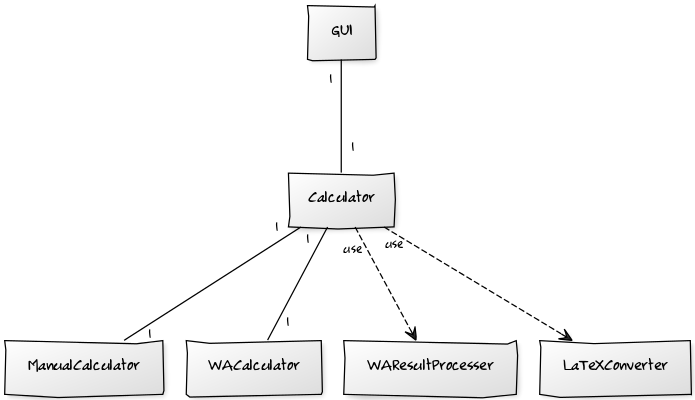

# Aiheen kuvaus ja rakenne
### Kuvaus
Kyseessä on käyttöliittymän avulla toimiva symbolinen laskin, joka hyödyntää
Wolfram Alphan [Full Results API](https://products.wolframalpha.com/api/explorer/)
-rajapintaa, antaa käyttäjälle vaihtoehtoisia ratkaisuja LaTeX-koodina, sekä
mahdollisen kuvaajan helposti liitettävänä kuvatiedostona. Mahdollisuuksien
mukaan helpoimpien laskujen ratkaiseminen pyritään toteuttamaan itse.
### Rakenne

