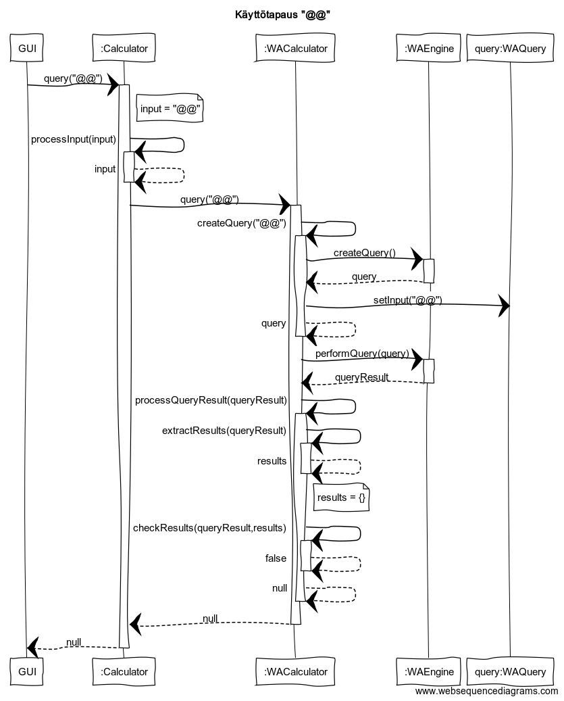

# Aihemäärittely
### Aihe
Kyseessä on käyttöliittymän avulla toimiva symbolinen laskin, joka hyödyntää
Wolfram Alphan [Full Results API](https://products.wolframalpha.com/api/explorer/)
-rajapintaa ja tarjoaa käyttäjälle tukemansa ratkaisut tyyliteltynä LaTeX-koodina.
### Käyttäjät
Kuka tahansa. Pitää olla Wolframin AppID.
### Käyttäjien toiminnot
- Laskun syöttäminen sille varattuun kenttään.
- Kentän tyhjentäminen nappia painamalla.
- Tuettujen ratkaisujen esittäminen nappia painamalla.
- LaTeX-muotoisen vastauksen kopioiminen nappia painamalla.
- AppID:n vaihtaminen omassa näkymässään.
# Luokkakaavio

# Käyttötapauksia

